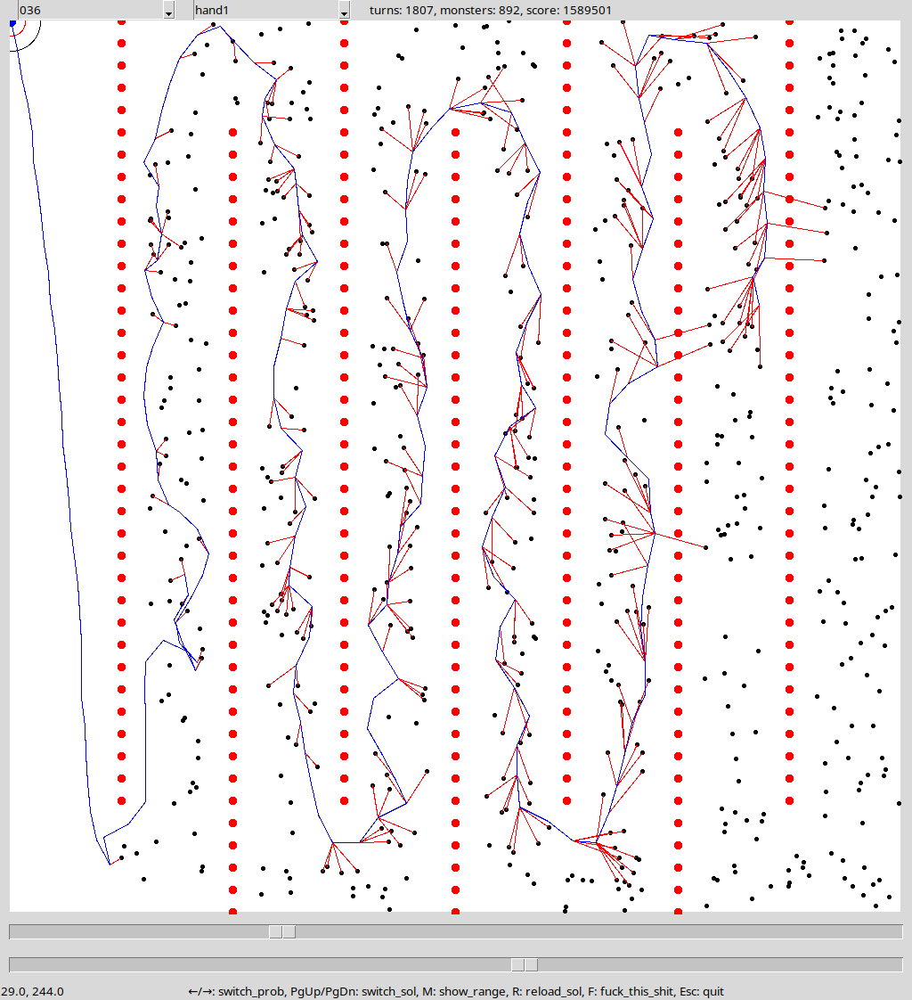

# WILD BASHKORT MAGES here! 🧙 🧙‍♂️ 🧙‍♀️  🪄

We placed 9th, and here's our write-up.

Initially, we intended for this contest to be our half-serious practice for ICFPC. But the contest turned out quite good, we got sucked in, and things got serious. 😎

Our staple approach in such contests is discrete optimization. It's our hammer, and everything else is nails. It's our square peg too, which we fit in round holes (and sometimes succeed). However, in recent ICFPCs, we've often been losing to probabilistic techniques, so one of our goals was to master this new kind of magic.

Our first solution was based on Nested Monte Carlo Search ([paper](https://www.lamsade.dauphine.fr/~cazenave/papers/nested.pdf)), and it carried us through day one. We finished this day 25th, which was good, but not great, and the missing component was probably Beam Search, but we couldn't figure out how to implement it efficiently. Moreover, our attention soon shifted to something different...

Looking at the scoreboard, we noticed that Wata is leading, and we couldn't stop wondering -- what could a single person team be doing, that is much better than what we do? Could it be something that is simple to implement, but maybe requires more computing resources?

Slowly, the gears turned in our heads, and we figured:

1. Wata is Japanese.
2. Japanese write using Kanji symbols.
3. Those who write Kanji win ICFPCs with Simulated Annealing.
4. ...
5. Profit!

Simulated Annealing!

Simulated Annealing!

Fucking Simulated Annealing! Not again!

We will... strike the Japanese with Simulated Annealing... ourselves!

Yes! We will master it!

野生の魔術師に用心

So, we dug up the write-ups of several teams from ICFPC 2023, and studied Simulated Annealing, and came up with this paragon of simplicity:

SA is used to build a permutation of monsters. Once the permutation is fixed by SA, the solution is built deterministically. We move towards the current monster until its within hitting range, and also try to get into position for hitting as many of the following monsters as possible using a greedy algorithm. Then we hit the monsters in the order of the permutation until the next monster is out of reach, and then repeat until we ~~win contest~~ run out of available turns.

We used the following transitions for SA (with different probabilities):
- Swapping two random neighboring monsters in the permutation;
- Reversing a random range of the permutation;
- Moving a random monster to a random place in the permutation;
- Swapping a random active (that is getting killed in the current solution) with the closest (geometrically) inactive monster;
- Removing a random active monster (putting it to the end of the permutation);
- Swapping an inactive monster that has the most gold (or exp) with the closest (geometrically) active monster.

Initial permutation was selected randomly and then improved with hill-climbing before starting SA.

We used linear cooling schedule, and run the algorithm with different starting temperatures and for different time (from 10 minutes to several hours).

For computation, we rented a couple of 8-core servers on Linode, and kept them busy during day 2. It costed a few bucks. If we rented more servers, we could probably climb a few places on the scoreboard, but decided not to throw any more money on it (it truly felt wrong).

A couple of problems, namely 36 and 37 ("the citadel of death"), are resilient to SA, so in the last hours of the contest we built an interactive tool for playing games, and one crazy mage (Artem) solved #36 by hand, earning ~1.6m points (960 relative)! We had no time left to solve #37 though.

Here is Artem's solution in our visualizer:

This time we also experimented with programming languages, using Tcl/Tk for the GUI, and Golang for the infrastructure. It was a success! The solvers are written in C++ (our usual tool). And Python was banished completely!

Will post the sources later.

Time to sleep now. Bye!
